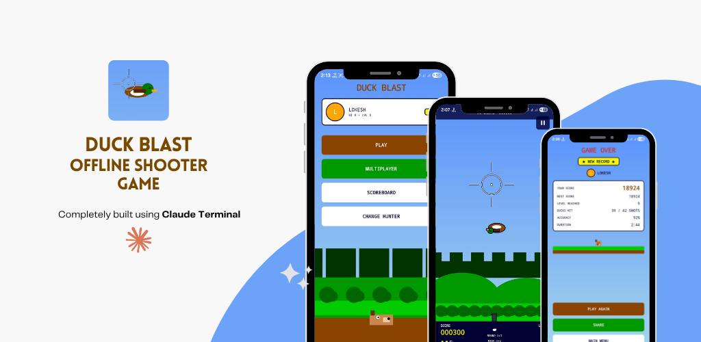

# Duck Blast



A retro-style duck-shooting game for Android — a love letter to the NES classic. Built with Jetpack Compose, with procedurally synthesized chiptune audio and no asset dependencies for sounds.

## Playstore


## Highlights

- **Single-player campaign** with progressive level difficulty, accuracy tracking, and round-clear bonuses.
- **LAN multiplayer** — host or join over local Wi-Fi using UDP discovery and a lightweight TCP game loop.
- **Per-hunter profiles** — high scores, streak days, lifetime stats, perfect-round counts.
- **Procedural audio** — every sound (gunshot, quack, fanfare, menu theme) is generated at runtime from sine/square waves and noise envelopes. No audio files shipped.
- **Looping menu theme** — synthesized chiptune that plays while the menu is on screen, anchored to navigation lifecycle.
- **Pure Compose rendering** — backgrounds, ducks, dog, and HUD are drawn on `Canvas`; no bitmaps.

## Tech Stack

| Layer | Choice |
|---|---|
| Language | Kotlin 2.0.21 |
| UI | Jetpack Compose (BOM 2024.11) |
| Navigation | androidx.navigation:navigation-compose |
| DI | Koin 4.0 |
| Persistence | ObjectBox 4.0 |
| Async | Kotlin Coroutines 1.9 |
| Multiplayer transport | Java sockets (TCP + UDP) with kotlinx.serialization JSON |

- `minSdk` 26 / `targetSdk` 35
- Portrait-only, hardware-accelerated

## Building & Running

Requirements:
- JDK 11+
- Android Studio Ladybug or newer (AGP 8.7)
- An Android device or emulator running API 26+

```bash
./gradlew :app:installDebug
```

Or open the project in Android Studio and run the `app` configuration.

## Project Structure

```
app/src/main/java/com/duckblast/game/
├── DuckBlastApp.kt            Application — starts Koin, preloads sounds, opens ObjectBox
├── MainActivity.kt            Hosts the NavGraph
├── audio/                     SoundManager + SoundSynthesizer (all sounds are synthesized)
├── data/
│   ├── model/                 ObjectBox entities (Profile, GameRecord)
│   ├── repository/            Data access
│   └── ObjectBoxStore.kt      Singleton store wrapper
├── di/                        Koin modules (AppModule, StorageModule, GameModule, ViewModelModule)
├── game/
│   ├── engine/                GameEngine — frame loop, spawning, collision, scoring
│   ├── entities/              Duck, projectile, plate models
│   ├── level/                 Level progression and difficulty curves
│   ├── renderer/              Canvas drawing for in-game scene
│   └── scoring/               Score / accuracy / bonus calculation
├── haptics/                   Vibration patterns for hits / game over
├── multiplayer/               LAN host/client, UDP discovery, message protocol
└── ui/
    ├── splash/                Title splash + flying duck loop
    ├── profile/               Hunter creation & selection
    ├── menu/                  Main menu (parallax backdrop, peeking dog)
    ├── game/                  In-game screen + ViewModel
    ├── gameover/              Stats summary
    ├── scoreboard/            Per-hunter history
    ├── multiplayer/           Lobby (host/join discovery)
    ├── navigation/            NavGraph and Screen routes
    └── theme/                 Colors, typography
```

## Audio System

`SoundSynthesizer` generates a `ShortArray` of 16-bit PCM for each `SoundId` at runtime — gunshots are noise-burst envelopes, the duck quack is a vibrato sine with segmented pitch, the menu loop is a 16-note C-major phrase over a 4-note bass line. `SoundManager` caches generated buffers in memory and plays them via `AudioTrack` (one-shots use a 4-thread executor; looping playback uses `setLoopPoints(0, len, -1)`).

Buffers are lazy-generated on first `play()` if preload hasn't finished — useful on cold start when the splash fanfare fires immediately.

## Persistence

ObjectBox stores two entities:
- `Profile` — hunter name, avatar color, high score, totals, streak.
- `GameRecord` — one row per game played, linked to a profile by `profileId`.

The selected profile id is held in `SharedPreferences` (`duckblast_prefs`).

## Multiplayer

- **Discovery** — UDP broadcast on a fixed port; hosts announce session id + name, clients listen and surface them in the lobby.
- **Game session** — host opens a TCP server; clients connect and exchange JSON `MultiplayerMessage`s (hit events, score sync, end-of-round). The level seed is shared at connection time so both sides simulate identically.

Both devices must be on the same Wi-Fi network.

## License

Personal/portfolio project — no license declared.
